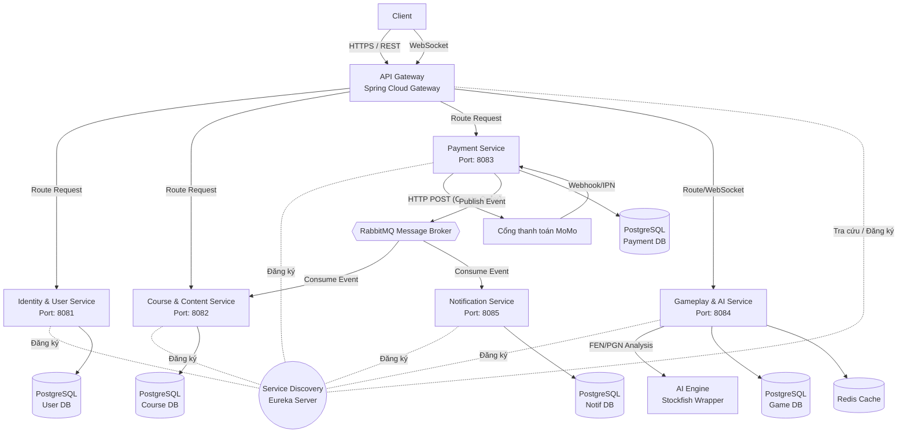

# Kiến trúc Hệ thống Dạy học Cờ vua Trực tuyến

## 1. Sơ đồ Kiến trúc Tổng quan (Mermaid)

## 2. Các Thành phần Cốt lõi (Core Components)

### 2.1. Tầng Giao tiếp (Client & Edge Layer)
* **Frontend Client:** Ứng dụng SPA (Single Page Application) xây dựng bằng ReactJS. Quản lý UI/UX, tích hợp thư viện cờ vua (như `chessboard.js` hoặc `react-chessboard`) để render bàn cờ.
* **API Gateway (Spring Cloud Gateway):** 
    * Chịu trách nhiệm định tuyến (Routing) mọi request từ Frontend tới các microservice phía sau.
    * Xử lý Cross-Cutting Concerns: Xác thực JWT (Authentication), giới hạn lưu lượng (Rate Limiting), và CORS.
* **Service Discovery (Eureka Server):** Lưu trữ danh bạ IP và Port của các service. Giúp API Gateway và các service tự động tìm thấy nhau để giao tiếp nội bộ.

### 2.2. Tầng Nghiệp vụ (Business Microservices Layer)
Mỗi service hoạt động độc lập, có cơ sở dữ liệu riêng (Database-per-service pattern):
* **Identity & User Service:** Quản lý thông tin tài khoản, xác thực người dùng, và theo dõi điểm hệ số ELO.
* **Course & Content Service:** Quản lý danh mục khóa học, bài giảng video, bài tập thực hành (puzzles) và trạng thái đăng ký của học viên.
* **Payment Service:** Xử lý toàn bộ logic liên quan đến giao dịch tài chính. Tích hợp trực tiếp với API MoMo (tạo mã thanh toán, hứng IPN/Webhook từ MoMo).
* **Gameplay & AI Service:** Trái tim của hệ thống thực hành. Quản lý các phiên chơi qua WebSockets, lưu vết các nước đi. Tích hợp với **AI Engine (Stockfish)** để đánh giá mức độ chính xác của nước đi và gợi ý chiến thuật.
* **Notification Service:** Lắng nghe các sự kiện hệ thống để gửi thông báo (Email, In-App Notification) cho người dùng.

### 2.3. Tầng Giao tiếp Bất đồng bộ (Event-Driven Layer)
* **RabbitMQ:** Message broker đóng vai trò trung gian phân phối các sự kiện (Events).
    * *Ví dụ nghiệp vụ:* Khi `Payment Service` xác nhận thanh toán MoMo thành công, nó không gọi trực tiếp API của `Course Service`. Thay vào đó, nó phát một sự kiện `PaymentSuccessEvent` lên RabbitMQ. `Course Service` và `Notification Service` sẽ tự động bắt lấy sự kiện này để kích hoạt khóa học và gửi email cảm ơn. Thiết kế này giúp hệ thống chịu lỗi tốt (Fault Tolerance) và lỏng lẻo hóa sự phụ thuộc (Loose Coupling).

### 2.4. Tầng Lưu trữ & Dữ liệu (Data Layer)
* **PostgreSQL:** Lựa chọn CSDL chính cho toàn bộ hệ thống. Đảm bảo tính toàn vẹn (ACID) cao cho Tài khoản, Khóa học, Thanh toán. Đối với Game (lưu trữ PGN) và Notification, sử dụng PostgreSQL giúp đồng nhất công nghệ, dễ vận hành và tận dụng sức mạnh của kiểu dữ liệu JSONB nếu cần cấu trúc linh hoạt.
* **Redis:** Cache bộ nhớ tốc độ cao, dùng để lưu trữ trạng thái bàn cờ đang diễn ra (In-game state) trước khi ván đấu kết thúc và lưu vào Postgres, hoặc cache các phiên kết nối WebSockets.

---

## 3. Quy trình Triển khai Dàn giáo (Deployment Skeleton)

Hệ thống được thiết kế để dễ dàng container hóa bằng **Docker**. Môi trường chạy local lý tưởng nhất là sử dụng `docker-compose` để khởi chạy đồng loạt toàn bộ tầng Infrastructure (PostgreSQL, Redis, RabbitMQ) cùng một lúc, trước khi chạy các service Spring Boot.

### 3.1. Các bước khởi chạy môi trường Dev:
1. Chạy `docker-compose up -d` để khởi động Database và Message Broker.
2. Khởi động **Eureka Server** (Discovery).
3. Khởi động **API Gateway**.
4. Khởi động lần lượt các microservice (User, Course, Payment, Game, Notification).
5. Khởi chạy ứng dụng Frontend (React).
